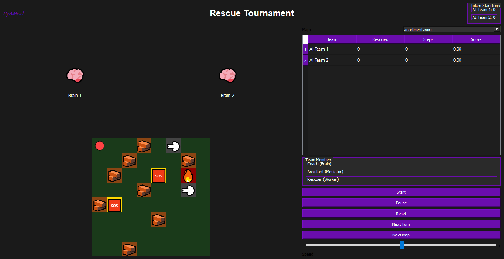
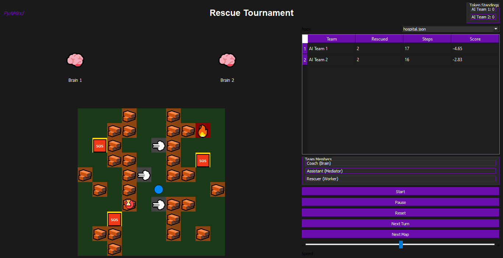
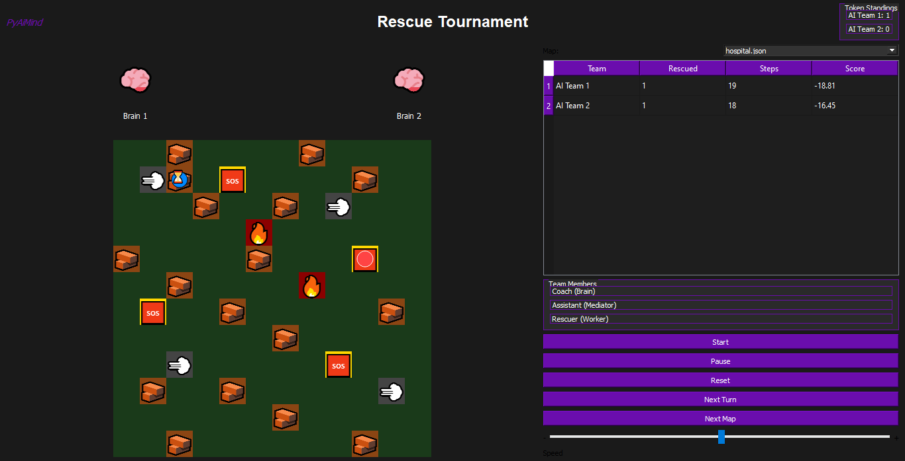
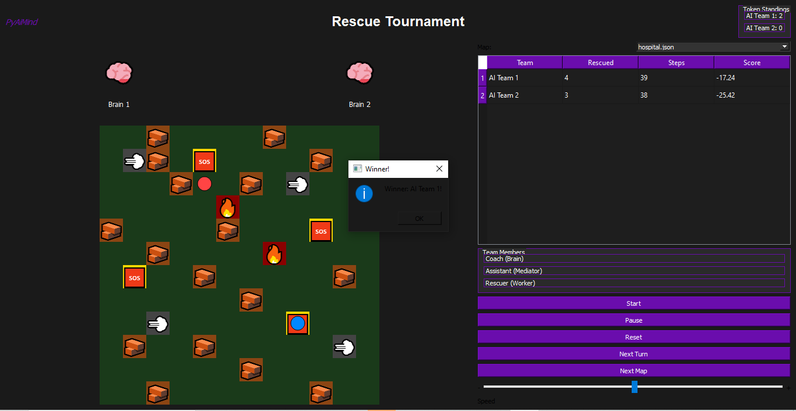
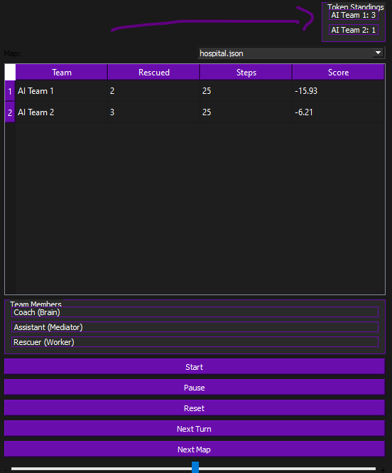

# 🏆 RACE - AI Rescue Tournament

An AI competition platform where teams of intelligent agents race to rescue trapped people in disaster simulations.

  

---

## 📸 Screenshots

| Main Window | Race Running | Target Rescued |
|:---:|:---:|:---:|
|  |  |  |

| Winner Popup | Tournament Tokens |
|:---:|:---:|
|  |  |

---

## 🧠 How It Works

Each team has three agents with strict separation of duties:

| Agent | Role |
|:---|:---|
| 🧠 Brain | Strategic planning, BFS pathfinding, learns from mistakes |
| 📡 Mediator | Translates high-level orders into step-by-step commands |
| 🚑 Worker | Executes moves, interacts with terrain, rescues people |

> **Golden Rule:** The Worker never decides. The Mediator never plans. The Brain never moves.

---

## 🌍 Maps & Obstacles

Three JSON-based disaster maps with realistic terrain:

| Map | Size | Theme |
|:---|:---|:---|
| 🏠 Apartment | 8×8 | Collapsed residential unit |
| 🏥 Hospital | 10×10 | Damaged medical facility |
| 🚇 Metro | 12×12 | Collapsed subway station |

Obstacles: 🪨 Rubble (slows down) | 🔥 Fire (respawns worker) | 💨 Smoke (limits vision) | 🆘 Trapped Person (goal)

---

## 🏁 Competition Rules

- **Turn-based**: Teams alternate moves like chess.
- **Instant Victory**: Race ends the moment a team rescues all its targets.
- **Auto-Referee**: Scores = (rescues × 10) − (steps) − (wasted steps × 0.5).
- **Tournament Mode**: 3 maps, winner of each gets +1 Token. Most tokens = Grand Champion.

---

## ⚡ Key AI Features

- **Experiential Learning**: Brains remember dangerous cells and avoid them (65% avoidance rate).
- **Risk Management**: 20% chance of crossing fire for a shortcut (failed risk = respawn).
- **Unpredictable Paths**: Random target selection keeps every match unique.

---

## 🚀 Quick Start

```bash
pip install PyQt5
python main.py
Controls: Start, Pause, Reset, Next Turn, Next Map, and a Speed Slider.

📁 Project Structure
text
Race_tournament/
├── main.py              # Entry point
├── gui.py               # PyQt5 interface (purple theme)
├── brain.py             # Strategic AI with memory & learning
├── worker.py            # Field agent with terrain reactions
├── mediator.py          # Command translator
├── team.py              # Wraps Brain, Mediator, Worker
├── race_manager.py      # Turn manager & auto-referee
├── tournament.py        # Multi-map championship
├── map_loader.py        # JSON map loader
├── maps/                # apartment.json, hospital.json, metro.json
├── screenshots/         # Project screenshots
└── tests/               # Test scripts
🛠️ Built With
Python 3.8+

PyQt5 (GUI)

BFS Algorithm (pathfinding)

JSON (maps & data)

💡 The Bigger Picture
This is the MVP of a larger vision: a "City of AI" where thousands of specialized, layered AI agents collaborate and compete to solve real-world problems.

## 📄 License

© [Year] Ali Valizadeh. All Rights Reserved.

This project is licensed under the Creative Commons
Attribution-NonCommercial-NoDerivatives 4.0 International
(CC BY-NC-ND 4.0).

You are free to view, study, and learn from this code for
personal, non-commercial purposes only. Any commercial use,
participation in competitions, or creation of derivative
works is strictly prohibited without explicit written
permission from the author.

🎯 Narrator (Human): Vision, testing, approval

🏗️ Engineer (ChatGPT): Architecture & prompts

## 🧪 Running Tests

Test files are located in the `Tests/` folder. To execute a test, copy it to the project root directory and run it with Python:

```bash
cp Tests/Test_worker.py .
python Test_worker.py

💻 Coder (DeepSeek): Raw implementation

👤 Author
Ali Valizadeh (PyAiMind)
AI Architect & Developer
Born: 2 Nov 2009

"Imagine it. Design it. Build it with AI."
Architect of tomorrow's intelligent worlds.


